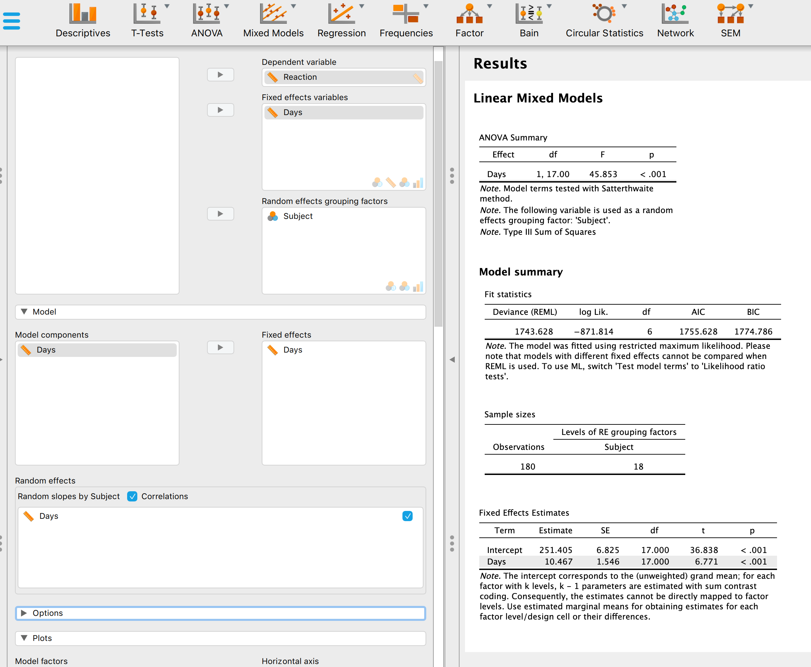

```{r setup, include=FALSE}
knitr::opts_chunk$set(echo = TRUE)
```


```{r, echo=FALSE, results='hide', message=FALSE, warning=FALSE}
library(tidyverse)
library(sjPlot)
library(lme4)
library(emo)
library(fontawesome)
library(hrbrthemes)
library(haven)
library(equatiomatic)
library(performance)
library(knitr)
library(printr)
library(xfun)


```

# Materials von Tag 1 und 2
Die Materials von Tag 1 & 2 findet ihr auf `r fa("github")` unter https://bit.ly/merk039, die Dokumentation des heutigen Tag 3 ist unter https://bit.ly/merk035 aufrufbar.

# Mein Plan für Tag III
* Wdh: Einfache Multi-Level Begriffe konzeptuell verstehen 
    * No Pooling, Complete Pooling, Shrinkage
    * Intercept Only Model, Random Intercept Model, Random Slope Model, Random Intercept and Random Slope Model
    * Intraklassenkorrelation
    * Fixed Effects, Random Effect
* Unsere Beispieldaten
* Einfache Multi-Level Modelle parametrisieren und schätzen

# Unsere Beispieldaten
```{r, echo = F, results='hide', eval = F, cache = T}
write_sav(sleepstudy, "data/data_sleepstudy.sav")

```

## Sleep Study
Im Paket `{lme4}` ist der `r embed_file("data/data_sleepstudy.sav", "data_sleepstudy.sav", "Datensatz")` `sleepstudy` enthalten. Diesen Daten liegt ein Experiment zugrunde indem dem Pbd Schlaf entzogen wurde Für uns wichtige Variablen sind:

* Reaction: Durchschnittliche Reaktionszeit in einem Reaktionszeitexperiment in (ms)
* Days: Anzahl der Tage des Schlafentzugs (der Schlafentzug startete nach dem zweiten Tag)
* Subject: Personidentifier

```{r, cache = T}
library(lme4)
head(sleepstudy)
```


## Popularity Data (Hox et al., 2017)
Dieser [Datensatz](https://github.com/MultiLevelAnalysis/Datasets-third-edition-Multilevel-book/blob/master/chapter%202/popularity/SPSS/popular2.sav) entstammt den einführenden Beispielen des gut lesbaren Lehrbuchs von Joop Hox et al (2017)
Für uns wichtige Variablen sind: 

* popular: Eine Likertskala zur Selbsteinschätzung der Beliebtheit
* extrav: Extraversion (Big Five)
* texp: Berufserfahrung der Lehrkraft

### Import
```{r, cache = T}
data_popularity <- read_sav(file ="https://github.com/MultiLevelAnalysis/Datasets-third-edition-Multilevel-book/blob/master/chapter%202/popularity/SPSS/popular2.sav?raw=true")

head(data_popularity)
```  


# Wdh: Begriffe

```{r, echo = F, message=FALSE, fig.align='center', warning=FALSE, fig.width=14, cache = T}
library(tidyverse)
library(highcharter)
library(viridisLite)
hchart(
  tibble(
  word = sample(c("no pooling", "complete pooling", "shrinkage", "partial pooling",
                  "perfect hierarchy", "imperfect hierarchy", "classification graph",
                  "multi-level proposition", "cluster robust modeling",
                  "multi-level as a nuisance", "random intercept", "random slope",
                  "intra class correlation", "deviance test"), 30, replace = T),
  freq = sample(1:50, 30, replace = T)),
  "wordcloud",
  hcaes(name = word, weight = log(freq)),
  ) %>% 
   hc_colors("#8CD000")

```

> AA: Elaboriert diese Begriffe in dem Ihr Sie auf eines der händisch skizzierten Datenbeispiele (siehe live-demo) anwendet.

# Einfache Multi-Level Modelle parametrisieren und schätzen
## Sleep Study 
### Die Mehrebenenstruktur verstehen {.tabset}
#### Fragestellung
> Wie kann die Mehrebenenstruktur der `Sleep Study Datensatzes` beschrieben werden?

#### Lösungshinweis 1
Mit `head(sleepstudy)` erkennt man, dass der Datensatz nur aus AV, UV, Subjectidentifier besteht. Also muss können maximal zwei Ebenen im Datensatz vorkommen.  
Bildet man ein Tabelle mit `Days` und `Subject` kann man entscheiden ob eine perfect iode rimperfecte Hierarchie vorliegt.

#### Lösungshinweis 2
Eine solche Tabelle erhält man mit `table(sleepstudy$Days, sleepstudy$Subject)`

#### Lösung
Es handelt um eine perfekte Zweiebenenstruktur mit folgenden Nestgrößen und folgender Nestanzahl:
```{r}
library(lme4) #enthält den Datensatz
# Nestanzahl
length(unique(sleepstudy$Subject))

# Nestgrößen
sleepstudy %>% 
  group_by(Subject) %>% 
  summarize(Nestgröße = n())
```

### Intraklasenkorrelation schätzen und verstehen {.tabset}
#### Fragestellung
Der ICC hilft dabei empirisch zu erkennen wie stark sich die Mehrebenenstruktur in der abhängigen Variable ausdrückt. Dazu schätzt man ein Intercept-Only Modell und setzt die Intercept-Varianz ins Verhältnis zur Gesamtvarianz.

```{r, echo = F}
extract_eq(lmer(Reaction ~ 1 + (1|Subject), data = sleepstudy))
```

#### Lösungshinweis 1
Die Syntax für das Intercept-Only Modell lautet `lmer(Reaction ~ 1 + (1|Subject), data = sleepstudy)`

#### Lösungshinweis 2
Richtig schnell geht es mit der Funktion `icc()` aus dem Package `{performance}`.

#### Lösung
```{r}
library(performance)
library(lme4)
mod01_sleepstudy <- lmer(Reaction ~ 1 + (1|Subject), data = sleepstudy)
icc(mod01_sleepstudy)
```

Dieser ICC ist vglw. groß! Multi-Level Modelling ist also nicht nur theoretisch impliziert sonder auch empirisch.

### Single Level Model schätzen {.tabset}
#### Fragestellung
Um später entscheiden zu können inwiefern Random Interept und Slope *empirisch* gerechtfertigt sind, kann man zunächst ein Single Level Model schätzen um dieses später mit den komplexeren Multi-Level Modellen zu schätzen.

#### Lösung
```{r}
mod02_sleepstudy <- lm(Reaction ~ Days, data = sleepstudy)
summary(mod02_sleepstudy)
```
Das entspricht einem Modell
```{r, echo = F}
extract_eq(mod02_sleepstudy, intercept = "beta", greek_colors = "#8cd000")
```
mit den Koeffizienten
```{r, echo = F}
extract_eq(mod02_sleepstudy, intercept = "beta", greek_colors = "#8cd000", use_coefs = T)
```

### Random Intercept Model schätzen und vergleichen {.tabset}

#### Fragestellung
Wie ändern sich die Koeffizienten des Modells, wenn man zulässt, dass Intercepts zwischen den Clustern variieren?

#### Lösungshinweis
Das Intercept kann ja als konstanter Prädiktor mit dem Wert 1 aufgefasst werden. Daher lautet die Syntax für das Random Intercept `(1|Subject)` (lies: »das Intercept darf über die Clustervariable `Subject` variieren«).

#### Lösung
```{r}
mod03_sleepstudy <- lmer(Reaction ~ Days + (1|Subject), data = sleepstudy)
summary(mod03_sleepstudy)
```
Das entspricht einem Modell
```{r, echo = F}
extract_eq(mod03_sleepstudy, intercept = "beta", greek_colors = "#8cd000")
```
mit den Koeffizienten
```{r, echo = F}
extract_eq(mod03_sleepstudy, intercept = "beta", greek_colors = "#8cd000", use_coefs = T)
```
Die Modelle vergleichen kann man mit der Syntax
```{r}
tab_model(mod01_sleepstudy, mod02_sleepstudy, mod03_sleepstudy)
```

Die Modelle gegeneinander Testen $H_0: \text{beide Modelle klären gleich viel Varianz auf}$ kann man mit dem `anova()`-Befehl:
```{r}
anova(mod03_sleepstudy, mod02_sleepstudy)
```
Unterschied ist signifikant, also steigert das Random Intercept die Modellpassung überzufällig.

### Random Intercept Random Slope Model schätzen und vergleichen {.tabset}
#### Fragestellung
Wie ändern sich die Koeffizienten des Modells, wenn man zulässt, dass Intercept und Slopes variieren?

#### Lösungshinweis
Die Syntax für ddie Random Effects lautet `(1 + Dayes|Subject)` (lies: »das Intercept und die Slopes dürfen über die Clustervariable `Subject` variieren«).

#### Lösung
```{r}
mod04_sleepstudy <- lmer(Reaction ~ Days + (1 + Days|Subject), data = sleepstudy)
summary(mod04_sleepstudy)
```
Das entspricht einem Modell
```{r, echo = F}
extract_eq(mod04_sleepstudy, intercept = "beta", greek_colors = "#8cd000")
```
mit den Koeffizienten
```{r, echo = F}
extract_eq(mod04_sleepstudy, intercept = "beta", greek_colors = "#8cd000", use_coefs = T)
```
Die Modelle vergleicht man mit der Syntax
```{r}
tab_model(mod01_sleepstudy, mod02_sleepstudy, mod03_sleepstudy, mod04_sleepstudy)
```

Die Modelle gegeneinander Testen $H_0: \text{beide Modelle klären gleich viel Varianz auf}$ kann man mit dem `anova()`-Befehl:
```{r}
anova(mod04_sleepstudy, mod03_sleepstudy)
```
Unterschied ist signifikant, also steigert der zusätzliche Random Slope die Modellpassung überzufällig.

# Multi-level Modelle in MPlus
```{r, echo=FALSE, results='hide'}
library(MplusAutomation)
mpmod <- 
  mplusObject(TITLE = "Random Intercept Random Slope Modell (sleepstudy)",
              VARIABLE = "NAMES ARE reac days subj;
                          CLUSTER = subj;
                          WITHIN = days;",
              ANALYSIS = "TYPE = TWOLEVEL RANDOM;",
              MODEL = "%WITHIN%
                       s | reac ON days;
                       %BETWEEN%
                       reac s;",
              autov = F,
              rdata = sleepstudy)

mplusModeler(mpmod, 
             modelout = "MPlus/mod.inp",
             run = 1L,
             hashfilename = F)
```

MPlus ist statistisch ultra-mächtig aber im vgl. zu `r fa("r-project", fill = "#8cd000")` sehr umständlich, da es keine Data Wrangling Funktionen hat. Daher muss man seine Multi-Level Daten zunächst mit einer anderen Software aufbereiten und als `r xfun::embed_file(c("MPlus/mod.dat"), "mod.dat", ".dat-File")` speichern, bevor man dieses wieder in MPlus einliest, in einem `r xfun::embed_file(c("MPlus/mod.inp"), "mod.inp", ".inp-Textfile")` die Syntax speichert und ausführt, aufdass die Ergebnisse dann in einem wiederum gesondeten `r xfun::embed_file(c("MPlus/mod.out"), "mod.out", ".out-Textfile")` gespeichert werden. Da es im Mplus keine Objektorientierung gibt, muss man dann Modellvergleiche (z.B. Devianztest) händisch anhand der beiden .out-Files machen.

`

Die Syntax sieht in MPlus wie folgt aus:

    TITLE:    Random Intercept Random Slope Modell (sleepstudy)
    DATA:     FILE = "MPlus/mod.dat";
     
    VARIABLE: NAMES ARE reac days subj;
              CLUSTER = subj;
              WITHIN = days;
    ANALYSIS: TYPE = TWOLEVEL RANDOM;
    MODEL:    %WITHIN%
              s | reac ON days;
              %BETWEEN%
              reac s;
              
# JASP
In JASP/jamovi bekommt ihr das Random Intercept Random Slope Modell, wenn ihr den `sleepstudy` Datensatz als `r embed_file("data/data_sleepstudy.sav", "data_sleepstudy.sav", ".sav-File")` einlest und dann die folgenden Einstellungen vornehmt:

```{r, echo = F, fig.cap="Einstellungen für ein Random Intercept Random Slope Modell"}

```

oder gleich diese `r embed_file("data/random_effects_sleepstudy.jasp", "random_effects_sleepstudy.jasp", "reproduzierbare JASP-Analyse")` öffnet.


# Literatur
Hox, J. J., Moerbeek, M., & Schoot, R. van de. (2017). Multilevel analysis: Techniques and applications (Third edition). Routledge.  

Gelman, A., & Hill, J. (2007). Data analysis using regression and multilevel/hierarchical models (Bd. 1). Cambridge University Press.  

Snijders, T. A., & Bosker, R. J. (2012). Multilevel analysis: An introduction to basic and advanced multilevel modeling (2nd ed). Sage.


<style>
.page-content .code-mask code, .page-content pre code {
    font-size: 1.15em !important;
}

.MathJax span {
    font-size: 100%;
}
</style>