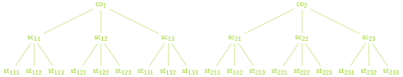
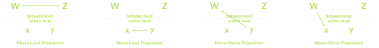

```{r setup, include=FALSE}
knitr::opts_chunk$set(echo = TRUE)
```


```{r, echo=FALSE, results='hide', message=FALSE, warning=FALSE}
library(tidyverse)
library(sjPlot)
library(lme4)
library(emo)
library(fontawesome)
library(hrbrthemes)
library(haven)
library(equatiomatic)
library(performance)
library(knitr)
library(printr)
library(xfun)


```

# Mein Plan für Tag II
* Beispieldaten kennenlernen
* Mehrebenenstrukturen erkennen und beschreiben 
    * Classification Graphs
    * Multilevel Propositions
    * Data Tables
* Mehrebenenanalysen begründen
    * Multi-Level Modeling as a nuisance
    * Multi-Level Modeling as an interesting question
    * Multi-Level Modeling as default
* Einfache Multi-Level Begriffe konzeptuell verstehen 
    * No Pooling, Complete Pooling, Shrinkage
    * Intercept Only Model, Random Intercept Model, Random Slope Model, Random Intercept and Random Slope Model
    * Intraklassenkorrelation
    * Fixed Effects, Random Effect
* Einfache Multi-Level Modelle parametrisieren und schätzen

# Unsere Beispieldaten
```{r, echo = F, results='hide', eval = F}
write_sav(sleepstudy, "data/data_sleepstudy.sav")

```

## Sleep Study
Im Paket `{lme4}` ist der `r embed_file("data/data_sleepstudy.sav", "data_sleepstudy.sav", "Datensatz")` `sleepstudy` enthalten. Diesen Daten liegt ein Experiment zugrunde indem dem Pbd Schlaf entzogen wurde Für uns wichtige Variablen sind:

* Reaction: Durchschnittliche Reaktionszeit in einem Reaktionszeitexperiment in (ms)
* Days: Anzahl der Tage des Schlafentzugs (der Schlafentzug startete nach Tag 2)
* Subject: Personidentifier

```{r}
library(lme4)
head(sleepstudy)
```


## BilaKi Daten
```{r}
data_bilaki_wide <- 
  read_sav("data/BilaKi_wide.sav") 

head(data_bilaki_wide)
```
Elke hat uns `r embed_file("data/BilaKi_wide.sav", "BilaKi_wide.sav", "Daten")`  aus ihrem Projekt mitgebracht. Diese liegen im `wide`-Format vor und müssen zunächst einmal in das `long`-Format gebracht werden. Das kann bequem mit dem im `tidyverse` enthaltenen Paket `{tidyr}` geschehen:

```{r}
data_bilaki_long <- 
  data_bilaki_wide %>% 
  pivot_longer(names_to = "variable", 
               values_to = "perf",
               cols = c(m0_s1, m1_s1, m2_s1))

head(data_bilaki_long)
```

Dann muss man noch aus den Variablennamen die Info über den Messzeitpunkt entnehmen und eine nominale Zeitvariable erstellen.
```{r}
data_bilaki_long <- 
  data_bilaki_long %>% 
  mutate(time = substr(variable, 2, 2),
         time_factor = factor(time))

head(data_bilaki_long)
```

## Popularity Data (Hox et al., 2017)
Dieser [Datensatz](https://github.com/MultiLevelAnalysis/Datasets-third-edition-Multilevel-book/blob/master/chapter%202/popularity/SPSS/popular2.sav) entstammt den einführenden Beispielen des gut lesbaren Lehrbuchs von Joop Hox et al (2017)
Für uns wichtige Variablen sind: 

* popular: Eine Likertskala zur Selbtseinschätzung der Beliebtheit
* extrav: Extraversion (Big Five)
* texp: Berufserfahrung der Lehrkraft

### Import
```{r}
data_popularity <- read_sav(file ="https://github.com/MultiLevelAnalysis/Datasets-third-edition-Multilevel-book/blob/master/chapter%202/popularity/SPSS/popular2.sav?raw=true")

head(data_popularity)
```  


# Mehrebenenstrukturen erkennen und beschreiben
## Begrifflichkeiten zur Beschreibung der Entitäten auf verschiedenen Ebenen
Leider sind in der Literatur sehr unterschiedliche Vokabularien unterwegs. So listen Snijders & Bosker (2012) etwa folgende Begriffe für die Einheiten auf Ebene 1 bzw. 2:

```{r, echo = F}
tibble(A = c("macro-level units", "macro-units", "primary units", "clusters", "level-two units"),
       B = c("micro-level units", "micro-units", "secondary units", "elementary units", "level-one units")) %>% 
  kable()
```

## Classification Diagramms
Eine typische und sehr heuristische Methode Mehrebenenstrukturen zu beschreiben stellt das Zeichnen sog. Classification Graphs dar (Snijders & Bosker, 2012).
```{r, echo = F, fig.cap="Perfekte Dreiebenenhierarchie", out.width="100%"}

```

Zeichnet man ein solches Diagramm für seinen Datensatz, erkennt man typischerweise die Anzahl der Ebenen und inwiefern eine perfekte/imperfekte Hierarchie vorliegt.

## Multilevel Propositions
Mit Mehrebenenmodellen werden Aussagen (Propositionen) in Mehrebenenstrukturen modelliert. Anders als im Single-Level-Fall, lohnt es sich hier nach Ebenen der abhängigen und unabhängigen Variablen zu unterscheiden:
```{r, echo = F, fig.cap="Multilevel Propositions", out.width="100%"}

```


## Data Tables
Auch in der Datenmatrix direkt erkennt man Mehrebenenstruktruren meist ganz gut:
```{r, echo = F}
tibble(
  Schule = 1:2,
  Klasse = 1:2,
  `Schüler*in` = 1:2
) %>% 
  tidyr::expand(Schule, Klasse, `Schüler*in`) %>% 
  kable()
```

# Mehrebenenanalysen begründen
* Multi-Level Modeling as a nuisance $\Rightarrow$ Cluster Robust Modeling
* Multi-Level Modeling as an interesting question $\Rightarrow$ Multi-Level Modeling
* Multi-Level Modeling as default $\Rightarrow$ Multi-Level Modeling

# Einfache Multi-Level Begriffe konzeptuell verstehen 

> Kernidee jeder Mehrebenenmodellierung ist, der Nestung der Daten dadurch Rechnung zu tragen, dass Effekte/Parameter zwar über die Cluster hinweg variieren können (Random Effects) aber simultan auch eine übergreifende Gemeinsamkeit modelliert wird (Fixed Effects). 

Prinzipiell ist graduierbar, inwiefern sich das Gesamtmodell eher den Gegebenheiten innerhalb der einzelnen Cluster anpasst oder eher den Clusterübergreifenden Begebenheiten. Dabei sind zwei Extremfälle denkbar:

1) Vollständige Anpassung innerhalb jedes Clusters $\Rightarrow \text{no pooling}$
2) Anpassung unter völliger Ignoranz der Cluster $\Rightarrow \text{complete pooling}$

Mehrebenenmodellierungen stellen eine Art $\text{partial pooling}$ dar. Dieses erfolgt in einer Art und Weise die sicherstellt, dass stark abweichende Cluster stärker von der Gesamtsituation beeinflusst werden bzw. umgekehrt selbige schwächer informieren.

## Beispiel für no pooling:
```{r, fig.width=12, fig.height=5, echo = F, message = F}
ggplot(sleepstudy %>% 
         filter(Subject %in% c(308, 309, 310, 330, 331)), aes(Days, Reaction)) + 
  geom_point(color = "#8cd000") + 
  facet_wrap(~Subject, ncol = 5) + 
  stat_smooth(method = "lm", se = F, color = "#8cd000") +
  theme_modern_rc() +
  ggtitle("No Pooling", "fünf ausgewählter Proband*innen") + 
  theme(strip.text = element_text(color = "#ffffff"))
```

## Beispiel für complete pooling:
```{r, fig.width=12, fig.height=5, echo = F, message = F}
ggplot(sleepstudy %>% 
         filter(Subject %in% c(308, 309, 310, 330, 331)), aes(Days, Reaction)) + 
  geom_point(color = "#8cd000") + 
  geom_abline(aes(intercept = 253.976, slope = 6.966), color = "#8cd000") +
  facet_wrap(~Subject, ncol = 5) + 
  theme_modern_rc() +
  ggtitle("Complete Pooling", "fünf ausgewählter Proband*innen") + 
  theme(strip.text = element_text(color = "#ffffff"))
```

## Complete und no pooling:
```{r, fig.width=12, fig.height=5, echo = F, message = F}
ggplot(sleepstudy %>% 
         filter(Subject %in% c(308, 309, 310, 330, 331)), aes(Days, Reaction)) + 
  geom_point(color = "#8cd000") + 
  geom_abline(aes(intercept = 253.976, slope = 6.966), color = "#8cd00050") +
  stat_smooth(method = "lm", se = F, color = "#8cd00050", linetype = "dashed") +
  facet_wrap(~Subject, ncol = 5) + 
  theme_modern_rc() +
  ggtitle("Complete und No Pooling", "fünf ausgewählter Proband*innen") + 
  theme(strip.text = element_text(color = "#ffffff"))
```


## Klassische (einfache) Mehrebenenmodelle
### Random Intercept Model
```{r}
mod01 <- lmer(Reaction ~ Days + (1|Subject),
              data = sleepstudy )

mod01

plot_model(mod01, type = "re") + 
  theme_modern_rc()

library(equatiomatic)
extract_eq(mod01)
```

### Random Slope Model
```{r}
mod02 <- lmer(Reaction ~  Days + (Days - 1|Subject),
              data = sleepstudy )

mod02

plot_model(mod02, type = "re") + 
  theme_modern_rc()

extract_eq(mod02)
```


### Random Intercept Random Slope Model
```{r}
mod03 <- lmer(Reaction ~  Days + (1 + Days|Subject),
              data = sleepstudy )

mod03

plot_model(mod03, type = "re") + 
  theme_modern_rc() +
  theme(strip.text = element_text(color = "#ffffff"))
```


### Intercept Only Model
```{r}
mod04 <- lmer(Reaction ~  1 + (1|Subject),
              data = sleepstudy )

mod04

extract_eq(mod04)
```
Das Intercept Only Model ist insofern informativ, als dass es Aussagen darüber erlaubt, inwiefern die abhängige Variable Clustering aufweist: Wäre die Clusterzugehörikeit nicht prädiktiv für die durchschnittliche Ausprägung der abhängigen Variable, wäre der die Varianz des Intercept = 0.

### Intraclass Coefficient (1)
Anhand des Intercept Only Models kann dann auch die sog. Intra Class Correlation bestimmt werden. Sie macht den Anteil der Intercept Varianz an der Gesamt varianz aus 

$$ICC(1) = \rho=\frac{\sigma^{2}_{\alpha_{j}}}{\sigma_{\alpha_{j}}^{2}+\sigma^{2}}$$
Wobei $\sigma^{2}_{\alpha_{j}}$ und $\sigma^{2}$ die Residuen auf Ebene 1 bzw. Ebene 2 des Intercept Only Models darstellen, in denen jeweils i und j die Indices für Micro- und Marcoeinheiten darstellen.

### Fixed Effects vs Random Effects
Die Begriffe Fixed Effects und Random Effects sind m.E. etwas missverständlich. Im Kern ist damit die Unterscheidung zwischen Punktschätzungen (z.B. $\gamma_{00}$) und "Parmetervarianzschätzungen" (z.B. $\sigma_{e}^{2}$) gemeint. Aus der Kombination beider können dann die "clusterspezifischen Parameter" (z.B. Random Slopes, Random Intercepts) abgeleitet werden (siehe Gelman & Hill, 2007))


# Einfache Multi-Level Modelle parametrisieren und schätzen
Da bei Anfänger\*innen typischerweise beliebt, stelle ich hier eine Art Kochrezept für eine typische - aber nicht immer erfolgreiche und problemlose - Vorgehenweise vor. Dabei beziehe ich mich auf die `BilaKi`-Daten

## Mehrebenenstruktur verstehen
Wir haben Messzeitpunkte in Individuen udn Individuen in Trainingsgruppen genested vorliegen (3-Ebenen Struktur).

## Überblick über Größe und Anzahl der Micro und Macro Units verschaffen
```{r}
data_bilaki_long %>% 
  na.omit(.) %>% 
  group_by(ID) %>% 
  summarize(N = n()) %>% 
  ggplot(., aes(N)) +
  geom_bar(color = "#8cd00000", fill = "#8cd000") + 
  ggtitle("Häufigkeit der Nestgrößen", "auf Ebene 1") + 
  theme_modern_rc()

data_bilaki_long %>% 
  na.omit(.) %>%
  select(V_ID, ID) %>% 
  distinct() %>% 
  group_by(V_ID) %>% 
  summarize(N = n()) %>% 
  ggplot(., aes(N)) +
  geom_bar(color = "#8cd00000", fill = "#8cd000") + 
  ggtitle("Häufigkeit der Nestgrößen", "auf Ebene 2") + 
  theme_modern_rc()
```

## ICC auf Ebene 1 schätzen
```{r}
lmer(perf ~ 1 + (1|ID), data = data_bilaki_long)

psychometric::ICC1.lme(perf, ID, data_bilaki_long)
```

## ICC auf Ebene 2 schätzen
```{r}
psychometric::ICC1.lme(perf, V_ID, data_bilaki_long)
```

## Einfaches Single-Level Modell mit Random-Intercept Modell vergleichen
### Single-Level Modell schätzen
```{r}
mod05 <- lm(perf ~ time_factor, data = data_bilaki_long)
```

### Multi-Level Modell schätzen
```{r}
mod06 <- lmer(perf ~ time_factor + (1|ID), data = data_bilaki_long)
extract_eq(mod06)
```

### Modelle vergleichen
```{r}
tab_model(mod05, mod06, 
          show.std = T)
```

### Modelle gegeneinander testen
```{r}
anova(mod06, mod05)
```


## Random-Intercept Modell mit Random Intercept and Random Slope Modell vergleichen
Hier leider nicht möglich, da zu wenige Beobachtungen.


# Literatur
Hox, J. J., Moerbeek, M., & Schoot, R. van de. (2017). Multilevel analysis: Techniques and applications (Third edition). Routledge.  

Gelman, A., & Hill, J. (2007). Data analysis using regression and multilevel/hierarchical models (Bd. 1). Cambridge University Press.  

Snijders, T. A., & Bosker, R. J. (2012). Multilevel analysis: An introduction to basic and advanced multilevel modeling (2nd ed). Sage.


<style>
.page-content .code-mask code, .page-content pre code {
    font-size: 1.15em !important;
}

.MathJax span {
    font-size: 100%;
}
</style>